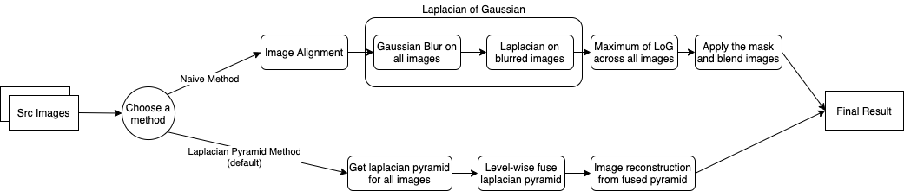

# Focus Stacking

This project is the final project of CS445 Fall2020,
Team: Zongnan Bao(zb3) and Han Chen(hanc3). It's guided by Wang and Chang's 2011 paper: ***[A Multi-focus Image Fusion Method Based on Laplacian Pyramid](https://pdfs.semanticscholar.org/9079/27b96fa87283efbc5f9a9a4202a7f8e879ff.pdf?_ga=2.245832256.531696024.1607257913-188213619.1607257913)***, and some other internet resources.

## Workflow:


## How To Use:
Run ***focus_stack.py*** with path to a DIRECTORY that contains input image files.
```bash
python3 focus_stack.py path_to_directory [optional: arguments and flags]
```
e.g.
```bash
python3 focus_stack.py test_img/test6
```
or with arguments,
```bash

python3 focus_stack.py --depth 10
```
The final result will be stored in `output.jpg` or the name you specified.

## Some OPTIONAL arguments and flags:
#### Arguments:
* --depth [INT] : the depth (level) of Laplacian Pyramid, default = 5.
* --k_size [INT] : the kernel size of Gaussian Kernel (an integer), default = 5.
* --output_name [STR] : the name of output file, default = 'output.jpg'.

#### Flags:
* -h : show all args and flags.
* --plot : to plot and show all the processes and stages of focus stacking.
* --naive : to use naive method (max LoG) for focus stacking.
* --eval : to evaluate the focusness(quality) before/after focus stacking using standard deviation, higher is better.

## Language and Dependent Packages:
* Python3
* OpenCV
* Matplotlib

## Source:
* Wang & Chang 2011, ***[A Multi-focus Image Fusion Method Based on Laplacian Pyramid](https://pdfs.semanticscholar.org/9079/27b96fa87283efbc5f9a9a4202a7f8e879ff.pdf?_ga=2.245832256.531696024.1607257913-188213619.1607257913)***
* [Test6 folder images source](https://www.cambridgeincolour.com/tutorials/focus-stacking.htm)
* Some code snippets cited inside helper.py

## TODO:
* Support colored image for laplacian method.
* Fix align image error for laplacian method, there is no align step right now. 