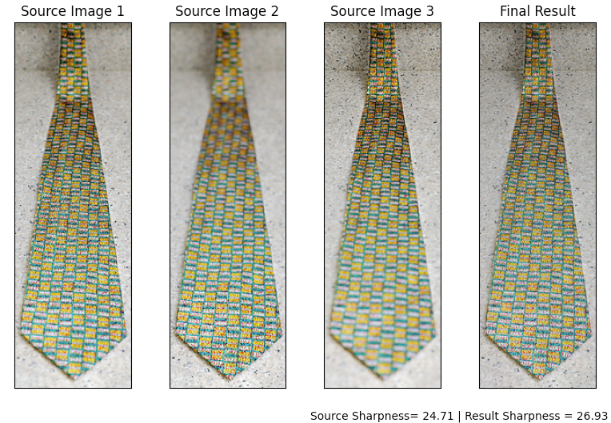
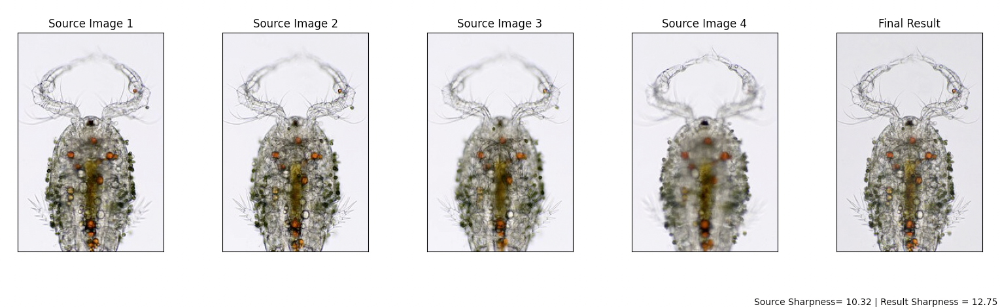
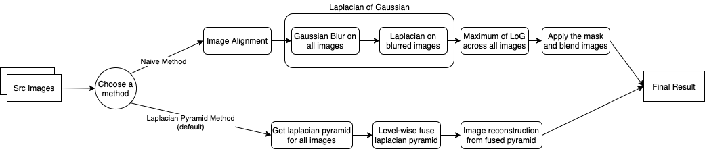

> ### Check out the latest homepage of [Focus Stacking](https://bznick98.github.io/project/focus-stacking)

# Focus Stacking
Focus stacking is a technique used in photography to increase the depth of field in an image by combining multiple images taken at different focus distances into a single image with greater sharpness and clarity from foreground to background. The process involves taking multiple shots of the same scene, each with a different focus distance, and then combining them into one single clear image.

In this project, I chose a pyramid-based method for decomposition, blending and fusion to achieve better final image quality.

Input Image Sequences      |  Result
:-------------------------:|:-------------------------:
   |  

## Result Demo



## Workflow

[> Detailed Report](Final%20Project%20Docs/CS445%20Final%20Project%20Report.pdf)

## Installation
```bash
# get the code
git clone https://github.com/bznick98/Focus_Stacking.git

# and go into project directory
cd Focus_Stacking

# use pipenv for virtual environment and package management
pipenv install .

# enable a pipenv virtual env shell, or append 'pipenv run ' before every run command
pipenv shell
```

## Run
```bash
# option 1. run focus stacking for all images under a directory
python run.py assets/test_images/test6/

# option 2. or specify images separately
python run.py img1.jpg img2.jpg ...

# for more details and configs, checkout
python run.py -h
```

## Some optional arguments and flags
#### Arguments:
* -d, --depth [INT] : the depth (level) of Laplacian Pyramid, default = 5.
* -k, --k_size [INT] : the kernel size of Gaussian Kernel (an integer), default = 5.
* -o, --output_path [STR] : the name of output file, default = 'output.jpg'.

#### Flags:
* -h : show help info, all descriptions of args and flags.
* --debug : for debugging, plot laplacian pyramids, original images, final result step by step.
* --plot : **TODO**: plot final results.
* --naive : to use naive method (max LoG) for focus stacking.
* --eval : to evaluate the focusness(quality) before/after focus stacking using standard deviation, higher is better.

## Source
* Wang & Chang 2011, ***[A Multi-focus Image Fusion Method Based on Laplacian Pyramid](https://pdfs.semanticscholar.org/9079/27b96fa87283efbc5f9a9a4202a7f8e879ff.pdf?_ga=2.245832256.531696024.1607257913-188213619.1607257913)***
* [Test6 folder images source](https://www.cambridgeincolour.com/tutorials/focus-stacking.htm)
* Some code snippets cited inside helper.py

## TODO
- [x] Support colored image for laplacian method. (Done!)
- [ ] Fix align image error for laplacian method, there is no align step right now. 
- [ ] Add GUI to the tool, make it easy to use for non-tech photography community.
- [ ] A more comprehensive homepage of Focus Stacking is setup, link is given at the top of the page.

