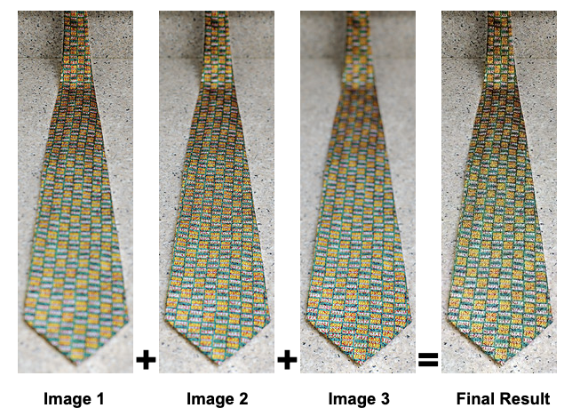

### Check out the homepage of [Focus Stacking](https://bznick98.github.io/project/focus-stacking)

# Focus Stacking

This project is the final project of CS445 Fall2020,
Team: Zongnan Bao(zb3) and Han Chen(hanc3). It's guided by Wang and Chang's 2011 paper: ***[A Multi-focus Image Fusion Method Based on Laplacian Pyramid](https://pdfs.semanticscholar.org/9079/27b96fa87283efbc5f9a9a4202a7f8e879ff.pdf?_ga=2.245832256.531696024.1607257913-188213619.1607257913)***, and some other internet resources.
This tool has two method implemented for blending images with different depth of field, we recommend using the default one (Laplacian Pyramid Method) since it produces better results.

## Demo:


## Workflow:

[> Detailed Report](Final%20Project%20Docs/CS445%20Final%20Project%20Report.pdf)

## How To Use:
```bash
# First clone the repo:
git clone https://github.com/bznick98/Focus_Stacking.git

# and go into project directory
cd Focus_Stacking

# (optional) Create a Python virtual environment for better package management. You can use conda, virtualenv, etc.

# Install required packages: OpenCV, Matlplotlib
pip install -r requirements.txt

# Run focus stacking program by:
python run.py PATH/TO/IMAGE/DIR/

# or specify images separately
python run.py PATH/TO/IMAGE1.jpg PATH/TO/IMAGE2.jpg ...

# For more argument detail, see:
python run.py -h
```

## Some optional arguments and flags:
#### Arguments:
* -d, --depth [INT] : the depth (level) of Laplacian Pyramid, default = 5.
* -k, --k_size [INT] : the kernel size of Gaussian Kernel (an integer), default = 5.
* -o, --output_name [STR] : the name of output file, default = 'output.jpg'.

#### Flags:
* -h : show help info, all descriptions of args and flags.
* --plot : plot laplacian pyramids, original images, final result step by step.
* --naive : to use naive method (max LoG) for focus stacking.
* --eval : to evaluate the focusness(quality) before/after focus stacking using standard deviation, higher is better.

## Language and Dependent Packages:
* Python3
* OpenCV
* Matplotlib

## Source:
* Wang & Chang 2011, ***[A Multi-focus Image Fusion Method Based on Laplacian Pyramid](https://pdfs.semanticscholar.org/9079/27b96fa87283efbc5f9a9a4202a7f8e879ff.pdf?_ga=2.245832256.531696024.1607257913-188213619.1607257913)***
* [Test6 folder images source](https://www.cambridgeincolour.com/tutorials/focus-stacking.htm)
* Some code snippets cited inside helper.py

## TODO:
* Support colored image for laplacian method. (Done!)
* Fix align image error for laplacian method, there is no align step right now. 
* Add GUI to the tool, make it easy to use for non-tech photography community.
